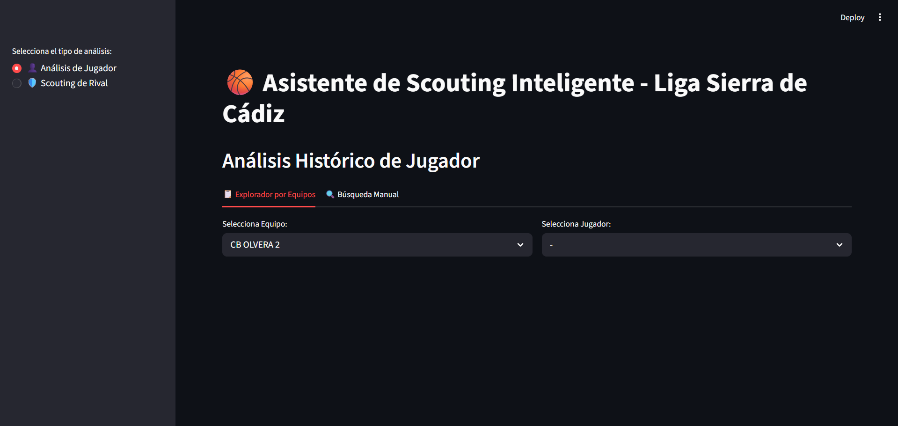

# 🏀 Asistente de Scouting AI - Liga Sierra de Cádiz

Una aplicación web interactiva diseñada para automatizar el análisis táctico y estadístico de los partidos de baloncesto de la Liga de la Sierra de Cádiz. Transforma las actas en formato Excel en informes visuales e inteligencia táctica generada por IA.

## ✨ Características Principales

* **📊 Explorador por Equipos:** Navegación intuitiva por plantilla y dorsales con unificación inteligente de nombres (manejo de errores tipográficos en actas).
* **📈 Gráficas Evolutivas (HD):** Visualización del rendimiento de puntos (PTS) y valoración (VAL) jornada a jornada mediante Plotly interactivo.
* **🤖 Entrenador IA Integrado:** Análisis cualitativo impulsado por LLMs (Groq - Llama 3 / Mixtral) que detecta patrones ofensivos y genera planes de partido ("Scouting de Rival").
* **📄 Exportación a PDF:** Generación de informes físicos a color, con gráficas en alta resolución y tablas tácticas, listos para llevar al banquillo.
* **🗄️ Base de Datos Local:** Migración automatizada de decenas de archivos Excel a una base de datos SQLite optimizada y ultrarrápida.

## 🛠️ Stack Tecnológico

* **Frontend & Framework:** [Streamlit](https://streamlit.io/)
* **Análisis de Datos:** Pandas
* **Visualización:** Plotly Express
* **Inteligencia Artificial:** Groq API (LLMs de código abierto)
* **Base de Datos:** SQLite3
* **Generación PDF:** FPDF2 + Kaleido

## 🚀 Uso en la Nube

Puedes probar la aplicación en vivo directamente desde tu navegador sin instalar nada:
👉 **[Enlace de la Demo](https://scoutingbaloncestoligasierracadiz.streamlit.app/)**

## 🔌 API REST (Backend Independiente)

El proyecto incluye un servidor **FastAPI** independiente (ubicado en `api/main.py`) que expone los datos de scouting a través de endpoints RESTful. 
Esto permite que otros sistemas (como aplicaciones móviles u otros frontends en React/Vue) puedan consumir las estadísticas de la liga de forma programática.